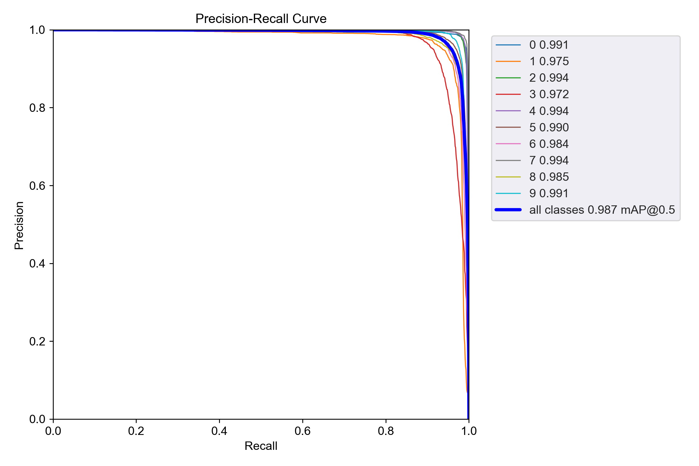

# Wagon Number Detection

## Описание

Проект предназначен для автоматического обнаружения и распознавания номеров вагонов на изображениях и видео с использованием модели YOLOv5.

## Установка

1. **Клонируйте репозиторий**:

   ```bash
   git clone https://github.com/ArtyomPass/wagon-number-detection.git
   ```

2. **Перейдите в директорию проекта:**

   ```bash
   cd wagon-number-detection
   ```

3. **Установите зависимости:**

   ```bash
   pip install -r requirements.txt
   ```

## Использование

Вы можете использовать уже обученные веса модели, расположенные по пути runs/train/exp/weights/best.pt, для обнаружения номеров вагонов на изображениях, видео или в реальном времени с помощью веб-камеры.

1. **Обнаружение на изображении:**

   ```bash
   python detect.py --weights runs/train/exp/weights/best.pt --source path/to/your/image.jpg
   ```

2. **Обнаружение на видео:**

   ```bash
   python detect.py --weights runs/train/exp/weights/best.pt --source path/to/your/video.mp4
   ```

3. **Обнаружение с веб-камеры:**

   ```bash
   python detect.py --weights runs/train/exp/weights/best.pt --source 0
   ```

## Обучение модели (при необходимости)

1. **Подготовьте датасет** в формате, совместимом с YOLOv5.
2. **Измените файл конфигурации `data.yaml`** для указания путей к вашему датасету.
3. **Запустите обучение:**

   ```bash
   python train.py --img 640 --batch 16 --epochs 50 --data data.yaml --weights yolov5s.pt
   ```
Примечание: Во время обучения все результаты, включая веса модели, журналы и изображения, будут сохранены в новой директории внутри runs/train/. Каждая новая сессия обучения создаёт новую папку с названием exp, exp1, exp2 и т.д.

## Результаты

### Метрики 


*Рисунок 1: Ключевые метрики модели на тестовом наборе данных (таких как mAP).*

### Матрица ошибок (Confusion Matrix)


*Рисунок 2: Матрица ошибок для классов модели на тестовом наборе данных.*

### Кривые метрик

- **Precision-Recall Curve**

  

  *Рисунок 3: Кривая Precision-Recall.*

- **Precision Curve**

  

  *Рисунок 4: Кривая Precision в зависимости от порога вероятности.*

- **Recall Curve**

  

  *Рисунок 5: Кривая Recall в зависимости от порога вероятности.*

- **F1-Score Curve**

  

  *Рисунок 6: Кривая F1-Score в зависимости от порога вероятности.*

### Примеры предсказаний на тестовом наборе

- **Оригинальные изображения с разметкой**

  
  
  

  *Рисунок 7: Примеры изображений с разметкой из тестового набора.*

- **Предсказания модели**

  
  
  

  *Рисунок 8: Примеры предсказаний модели на тестовых изображениях.*

## Требования

- Python 3.7 или выше
- PyTorch
- OpenCV
- Другие зависимости указаны в `requirements.txt`

